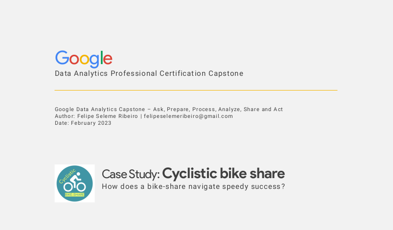
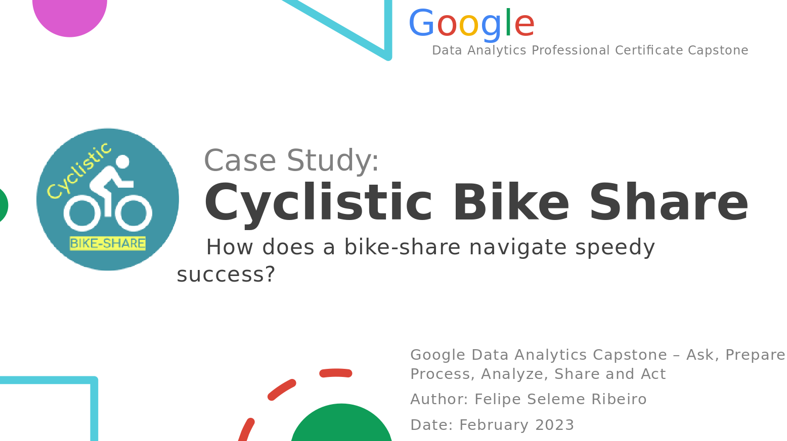
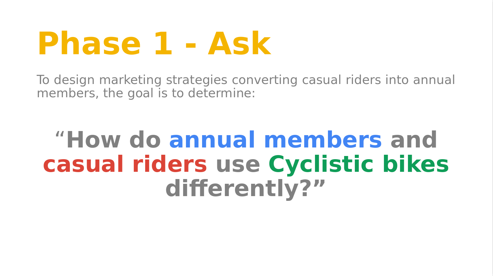

# google_capstone
 🎖️ Google Data Analytics Professional Certification Capstone

### Welcome!
This repository contains the results of the Google Data Analytics Prefessional Certification Capstone.  
  
The case study was made for a fictitious bike share company (Cyclistic) located in Chicago. The director of marketing 
believes the company’s future success depends on maximizing the number of annual memberships. Therefore, the main goal 
is to understand how casual riders and annual members use Cyclistic bikes differently.  
  
I used the previous 12 months of [Cyclistic trip historical data](https://divvy-tripdata.s3.amazonaws.com/index.html) 
to analyze and identify trends. The data has been made available by Motivate International Inc. under 
[this license](https://ride.divvybikes.com/data-license-agreement).
  
  
### Full Documentation:
The [Capstone Documentation PDF](CapstoneDocumentation.pdf) is a file that has all the steps of the analysis process.  
  
  
### Case Study Presentation:
The [Case Study Result Presentation PPTX](CaseStudyResultPresentation.pptx) is a presentation with the main topics of the result of the analysis process.  
  
  
### The Code:
All Python codes are in the [main.py](main.py) file.  
  
  
### Other Files:
The [Chicago Interactive Map HTML](chicago_interactive_map.html) is an interactive map that shows the main used stations by user type (casual end member).  
The [Data](Data) folder has other files such as the downloaded '.csv' files and the graphs produced for the analyses.  
  
  
  
_Feel free to contact me: **felipeselemeribeiro@gmail.com**_  
_Thanks for visiting!_  
  
  

### Scenario
You are a junior data analyst working in the marketing analyst team at Cyclistic, a bike-
share company in Chicago. The director of marketing believes the company’s future
success depends on maximizing the number of annual memberships. Therefore, your
team wants to understand how casual riders and annual members use Cyclistic bikes
differently. From these insights, your team will design a new marketing strategy to
convert casual riders into annual members. But first, Cyclistic executives must approve
your recommendations, so they must be backed up with compelling data insights and
professional data visualizations.

### Characters and teams
- Cyclistic: A bike-share program that features more than 5,800 bicycles and 600
docking stations. Cyclistic sets itself apart by also offering reclining bikes, hand tricycles,
and cargo bikes, making bike-share more inclusive to people with disabilities and riders
who can’t use a standard two-wheeled bike. The majority of riders opt for traditional
bikes; about 8% of riders use the assistive options. Cyclistic users are more likely to ride
for leisure, but about 30% use them to commute to work each day.
- Lily Moreno: The director of marketing and your manager. Moreno is responsible for
the development of campaigns and initiatives to promote the bike-share program. These
may include email, social media, and other channels.
- Cyclistic marketing analytics team: A team of data analysts who are responsible for
collecting, analyzing, and reporting data that helps guide Cyclistic marketing strategy.
You joined this team six months ago and have been busy learning about Cyclistic’smission and business goals — as well as how you, as a junior data analyst, can help
Cyclistic achieve them.
- Cyclistic executive team: The notoriously detail-oriented executive team will decide
whether to approve the recommended marketing program.

### About the company
In 2016, Cyclistic launched a successful bike-share offering. Since then, the program has
grown to a fleet of 5,824 bicycles that are geotracked and locked into a network of 692
stations across Chicago. The bikes can be unlocked from one station and returned to
any other station in the system anytime.
Until now, Cyclistic’s marketing strategy relied on building general awareness and
appealing to broad consumer segments. One approach that helped make these things
possible was the flexibility of its pricing plans: single-ride passes, full-day passes, and
annual memberships. Customers who purchase single-ride or full-day passes are
referred to as casual riders. Customers who purchase annual memberships are Cyclistic
members.
Cyclistic’s finance analysts have concluded that annual members are much more
profitable than casual riders. Although the pricing flexibility helps Cyclistic attract more
customers, Moreno believes that maximizing the number of annual members will be key
to future growth. Rather than creating a marketing campaign that targets all-new
customers, Moreno believes there is a very good chance to convert casual riders into
members. She notes that casual riders are already aware of the Cyclistic program and
have chosen Cyclistic for their mobility needs.
Moreno has set a clear goal: Design marketing strategies aimed at converting casual
riders into annual members. In order to do that, however, the marketing analyst team
needs to better understand how annual members and casual riders differ, why casual
riders would buy a membership, and how digital media could affect their marketing
tactics. Moreno and her team are interested in analyzing the Cyclistic historical bike trip
data to identify trends.  

  

  

  

To design marketing strategies aimed at converting casual riders into annual members,
the goal is to determine “how do annual members and casual riders use Cyclistic bikes
differently?”