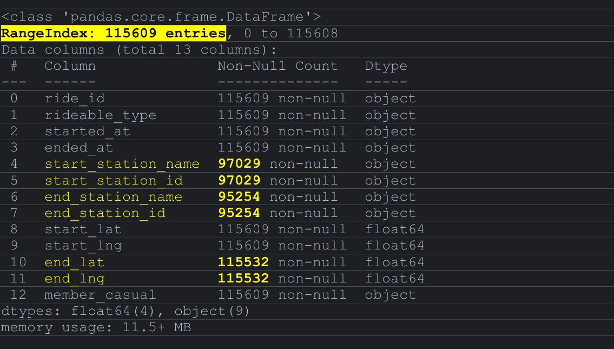
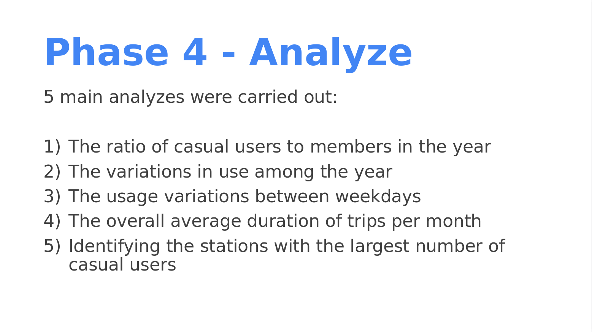
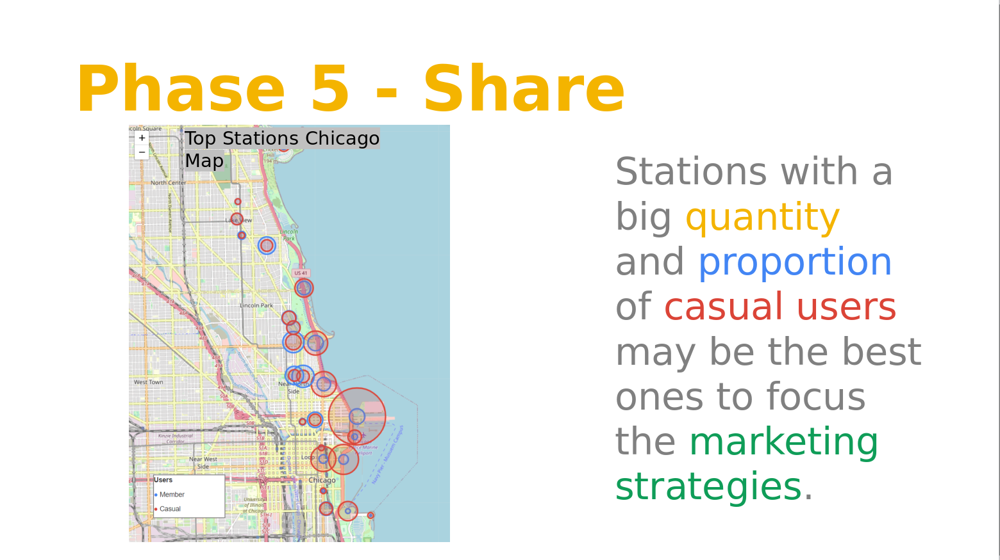

# google_capstone
 🎖️ Google Data Analytics Professional Certification Capstone  

  

### Welcome!
This repository contains the results of the Google Data Analytics Prefessional Certification Capstone.  
  
The case study was made for a fictitious bike share company (Cyclistic) located in Chicago. The director of marketing 
believes the company’s future success depends on maximizing the number of annual memberships. Therefore, the main goal 
is to understand how casual riders and annual members use Cyclistic bikes differently.  
  
I used the previous 12 months of [Cyclistic trip historical data](https://divvy-tripdata.s3.amazonaws.com/index.html) 
to analyze and identify trends. The data has been made available by Motivate International Inc. under 
[this license](https://ride.divvybikes.com/data-license-agreement).
  
  
### Full Documentation:
The [Capstone Documentation PDF](CapstoneDocumentation.pdf) is a file that has all the steps of the analysis process.  
  
  
### Case Study Presentation:
The [Case Study Result Presentation PPTX](CaseStudyResultPresentation.pptx) is a presentation with the main topics of the result of the analysis process.  
  
  
### The Code:
All Python codes are in the [main.py](main.py) file.  
  
  
### Other Files:
The [Chicago Interactive Map HTML](chicago_interactive_map.html) is an interactive map that shows the main used stations by user type (casual end member).  
The [Data](Data) folder has other files such as the downloaded '.csv' files and the graphs produced for the analyses.  
  
  
  
_Feel free to contact me: **felipeselemeribeiro@gmail.com**_  
_Thanks for visiting!_  
  
  

### Scenario
You are a junior data analyst working in the marketing analyst team at Cyclistic, a bike-
share company in Chicago. The director of marketing believes the company’s future
success depends on maximizing the number of annual memberships. Therefore, your
team wants to understand how casual riders and annual members use Cyclistic bikes
differently. From these insights, your team will design a new marketing strategy to
convert casual riders into annual members. But first, Cyclistic executives must approve
your recommendations, so they must be backed up with compelling data insights and
professional data visualizations.

### Characters and teams
- Cyclistic: A bike-share program that features more than 5,800 bicycles and 600
docking stations. Cyclistic sets itself apart by also offering reclining bikes, hand tricycles,
and cargo bikes, making bike-share more inclusive to people with disabilities and riders
who can’t use a standard two-wheeled bike. The majority of riders opt for traditional
bikes; about 8% of riders use the assistive options. Cyclistic users are more likely to ride
for leisure, but about 30% use them to commute to work each day.
- Lily Moreno: The director of marketing and your manager. Moreno is responsible for
the development of campaigns and initiatives to promote the bike-share program. These
may include email, social media, and other channels.
- Cyclistic marketing analytics team: A team of data analysts who are responsible for
collecting, analyzing, and reporting data that helps guide Cyclistic marketing strategy.
You joined this team six months ago and have been busy learning about Cyclistic’smission and business goals — as well as how you, as a junior data analyst, can help
Cyclistic achieve them.
- Cyclistic executive team: The notoriously detail-oriented executive team will decide
whether to approve the recommended marketing program.

### About the company
In 2016, Cyclistic launched a successful bike-share offering. Since then, the program has
grown to a fleet of 5,824 bicycles that are geotracked and locked into a network of 692
stations across Chicago. The bikes can be unlocked from one station and returned to
any other station in the system anytime.
Until now, Cyclistic’s marketing strategy relied on building general awareness and
appealing to broad consumer segments. One approach that helped make these things
possible was the flexibility of its pricing plans: single-ride passes, full-day passes, and
annual memberships. Customers who purchase single-ride or full-day passes are
referred to as casual riders. Customers who purchase annual memberships are Cyclistic
members.
Cyclistic’s finance analysts have concluded that annual members are much more
profitable than casual riders. Although the pricing flexibility helps Cyclistic attract more
customers, Moreno believes that maximizing the number of annual members will be key
to future growth. Rather than creating a marketing campaign that targets all-new
customers, Moreno believes there is a very good chance to convert casual riders into
members. She notes that casual riders are already aware of the Cyclistic program and
have chosen Cyclistic for their mobility needs.
Moreno has set a clear goal: Design marketing strategies aimed at converting casual
riders into annual members. In order to do that, however, the marketing analyst team
needs to better understand how annual members and casual riders differ, why casual
riders would buy a membership, and how digital media could affect their marketing
tactics. Moreno and her team are interested in analyzing the Cyclistic historical bike trip
data to identify trends.  

  

## Phase 1 - Ask
To design marketing strategies aimed at converting casual riders into annual members,
the goal is to determine “how do annual members and casual riders use Cyclistic bikes
differently?” 

  

## Phase 2 - Prepare  
To analyze and identify trends, I’m going to use the previous 12 months of Cyclistic’s
historical trip data made available by Motivate International Inc.  
The data is reliable as it was obtained directly from the company.  
The files are in CSV format and have the unique identification information for each trip
(primary key) "ride_id", the type of transport used "rideable_type", the type of user (casual
or member) "member_casual", date and time of start of the tour "started_at", date and
time of the end of the tour "ended_at", the name of the start station "start_station_name",
the identification key of the start station "start_station_id", the name of the end station
"end_station_name", the identification key of the end station "end_station_id",
geographic data (latitude and longitude) of the start and end stations "start_lat",
"start_lng", "end_lat" and "end_lng".

## Phase 3 - Process

For the data processing, we will use the Pandas library in Python (PyCharm). Python
enables you to handle large volumes of data quickly and efficiently.
Importing the Pandas library:

With CSV files downloaded from the "Data" folder located in the same directory as the
Python code development file, called "main.py", read the files and define their variables:

Checking the structure and formatting of dataframes:  
Starting with the “df_2022_02” 
INPUT  

OUTPUT

Some inconsistencies are noted:  
### 1 - The time attributes "started_at" and "ended_at" are in string format.

### 2 - Null values are shown in the attributes "start_station_name", "start_station_id", "end_station_name", "end_station_id", "end_lat" and "end_lng".

All tables have the same structure and formatting standards. The inconsistencies found
in the "df_2022_02" data frame are repeated in the others.  
As the structure is the same, we can proceed consolidating the tables into a single
DataFrame.  
INPUT  

Let's adjust the date/time attributes:  

INPUT

OUTPUT

It seems all right.  
Because it has not yet been defined whether attributes that have null values will be
relevant to all analyses or not, we will deal with them later if necessary.  
For now, let's add the attribute by calculating the duration of each trip.  

INPUT

We'll also add a column that brings the day of the week corresponding to the trip date
column.  

INPUT

Finally, taking advantage of the geographic coordinates of the collection and delivery
points, we will create a column with the result of the distance between those points.  
Let's use the "geopy" library  

We will define a function that seeks the latitude and longitude information of the source
and end points and ignores if there are null values. Returning the distance between the
points in kilometers.  

INPUT

And enter the code to perform the calculations in the DataBase.  

INPUT

Finally, let's reorder the columns for a more intuitive view.  

INPUT

Because of the size of the DataBase, the processing time of the distance calculation has
increased significantly. As we have not yet defined the relevance of this information, let’s
leave aside for now.  
Latest checks:  
Search for duplicate information by the "ride_id" key.  

INPUT

OUTPUT

There are no duplicate records.  
Let's then check for anomalies in the "duration" attribute.  

INPUT

OUTPUT

Negative time values are anomalies. Let's eliminate these records.  
The column values are in Timedelta format:   

> 5 duration timedelta64[ns]

Counting negative or zero values to determine whether the absence of such information
may impact future analysis results:  

INPUT

OUTPUT

> There are 534 negative or equal to zero values in the duration column.  

A total of 534 records were found with negative Timedelta. As the DataFrame has
5,754,248 records, the representativeness is approximately 0.000093%. Let's proceed
with the deletion of the records.  

INPUT

OUTPUT

Then we need to understand and treat the values with duration above normal.  
Let's look at the amount of trips equal to or greater than a day:  

INPUT

OUTPUT

> There are 5390 values greater than 1 day in the duration column.  

The representativeness of these values is approximately 0.00094%. So let's proceed with
the elimination of these records for further future analysis.  

INPUT

OUTPUT

Finally, let's search for null values in all columns and evaluate their representations:  

INPUT

OUTPUT

Only attributes with start and end stations IDs have significant null values. Deleting these
records would represent approximately 15.62% of the total partially cleaned DataFrame.  
We will choose to do the first analyses with the full DataFrame and clean up the null
values for the identifications of the stations at the time this information is for analysis.  
With everything organized, we are ready to start the analysis.  

## Phase 4 - Analyse

Let's divide the analyses into five steps starting with a more global view of proportion by
user type and then deepening the correlation of each attribute.  
For data visualization, let's use the "matplotlib" library:  

INPUT

FIRST STEP  
1) The ratio of casual users to members in the year gives an overview of the amount of
potential new members. (pie chart)  

INPUT

OUTPUT

59.3% of users are already members. 40.7% of users remain for a possible conversion.  
We need to better understand the behavior of these users to learn how we can revert
them into members.  

SECOND  
2) The variations in use among the year (seasonality) and the correlations between
casual users and members can bring relevant information regarding the behavior of
users in relation to the different times of the year. (line chart)  

INPUT

OUTPUT

There is a big difference in the number of users during the year. In the summer months
both casual users and members use the service much more. The number of members
remains higher throughout the year, however, in July there was a significant spike in thenumber of casual users almost reaching the same number of members. This can point to a profile of users who are on vacation and/or tourists.  
A marketing action to convert casual users into members should be more effective in
the summer, especially in June and July.  

THIRD  
3) Usage variations between weekdays and correlations between casual users and
members aim to identify user patterns and profiles between weekdays and weekends.
(stacked column chart)  

INPUT

OUTPUT

The total number of trips per day of the week is quite stable. However, when considering casual users, a significant increase in usage is observed on Saturdays.  
Weekends seem like the best days to reach casual users.  

FOURTH  
4) The overall average duration of trips per month and by user type should show whether
there are differences and correlations between usage patterns. (chart of grouped
columns)  

INPUT

OUTPUT

Casual users clearly tend to ride longer. Members uses the bikes for shorter periods.  
This can point to a tendency for casual users to use the service to ride around and enjoy
the day, while member users may tend to use more as a transportation way (such as
going from home to work).  
But that's just un assumption to be confirmed through surveys. For now, we will proceed
with the analysis of the data we have.  

FIFTH  
5) Identifying the stations with the largest number of casual users and stations with the
highest proportion of casual users can be a good tool for converting members.  

INPUT

OUTPUT

The "Streeter Dr & Grand Ave" station is notably the most widely used starting point for
casual users. In addition to the quantity, it is interesting to note the proportions between
user types. There are stations that are used in smaller total quantity, but that have a very
large proportion of casual users. All these stations should be taken into consideration
for a better understanding of the target users and marketing actions.  

INPUT

OUTPUT

With some differences, the volume of use of stations as endpoint is quite similar to the
collection data.  
Let's create a DataFrame that shows the total usage value of the stations, separated by
member and casual users, and add the geographic data so that we can view the
information on a map.  

INPUT

OUTPUT

Now we can use this DataFrame on a map to get a better understanding of the types of
users per station throughout the city. 

Let's create the map:  

INPUT

OUTPUT

The red circles represent casual users and blue circles represent the members. Circle
sizes are proportional to the travel quantity.  
This can help to visualize the location of the most used stations by casual users for a better understanding and conduct of surveys and marketing actions.  
Now that we've identified usage patterns, days of the year, week days, and stations with
the most casual users, we know when and where to focus marketing actions. It is important to use this information to apply surveys to better understand the profile of
casual users and to know the reasons why they do not become members.  

## Phase 5 - Share

For the presentation, let's insert the charts into Power Point and point out the most
important information and analysis.  

## Phase 6 - Act

